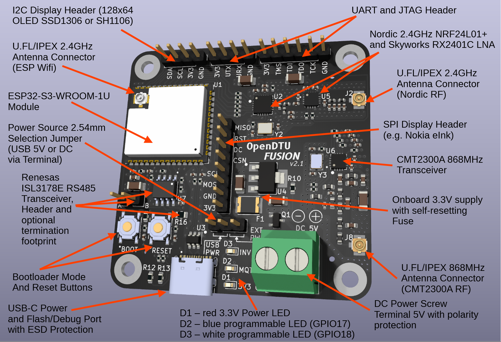

# OpenDTU Fusion

This board was developed by [@markusdd](https://github.com/markusdd){target=_blank} and the help of the OpenDTU/ahoy Discord community.
It integrates all the components that are necessary to run OpenDTU on 5.5cm x 5.5cm, namely a ESP32-S3-WROOM-1U module, and the complete RF paths for NRF24 (HM series) and CMT2300A (HMS/HMT series) communications. So this PCB can interface with all supported inverters and uses the most modern ESP32-S3 chip.

Generic builds for the esp32-s3-usb are available in the OpenDTU Release section. The board specific documentation is available over at the OpenDTUFusion Documentation repository: <https://github.com/markusdd/OpenDTUFusionDocs>

For info on where to buy this board refer to the [Where to get](https://github.com/markusdd/OpenDTUFusionDocs#where-to-get) section.

OpenDTU also ships a OpenDTUFusion specific pinout JSON in it's repository which can be found here: <https://github.com/tbnobody/OpenDTU/blob/master/docs/DeviceProfiles/opendtu_fusion.json>
