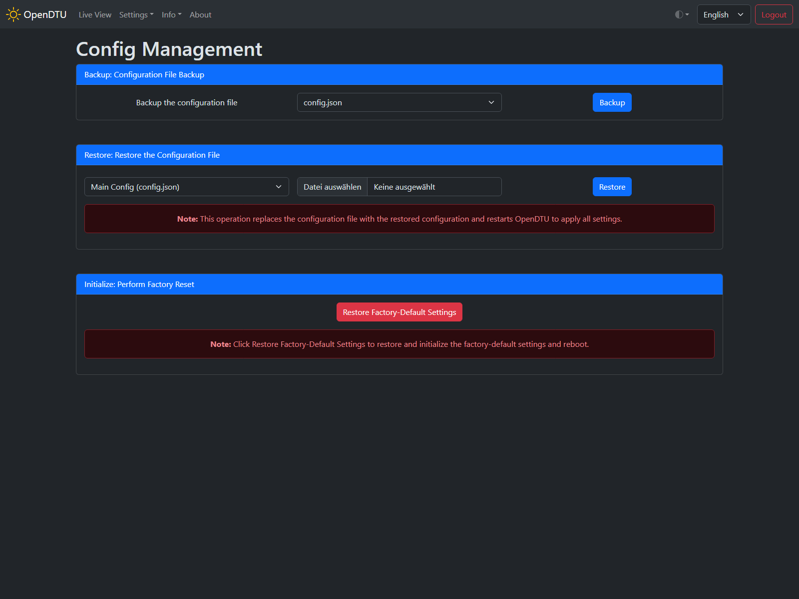

# Config Management

## Screenshot

## Settings / Parameters

### Backup: Configuration File Backup

#### Delete :material-button-cursor:{title="Button"}

Click the red trash download button delete the selected config file from the device.

#### Download :material-button-cursor:{title="Button"}

Click the blue download button to download the selected config file. The format of this file is `.json` and can be opened with any text editor.

### Restore: Restore the Configuration File

#### Target file selection :material-form-dropdown:{title="Dropdown"}

Select the file type which you are going to upload. The following values are possible:

* Main Config (`config.json`): A config file which was [previously backed up](#backup-configuration-file-backup)
* Pin Mapping (`pin_mapping.json`): A [Device Profile](../device_profiles.md) configuration file.
* Language Pack (`pack.lang.json`): A [Language Pack](../language_pack.md) which contains translations for the web app.

!!! info "Info"

    If the `.json` file is not parsable or does not match the selected type the upload will be denied.

#### Source file selection :material-file-upload:{title="File"}

Select the source file on your computer which you like to upload to the ESP.

#### Restore :material-button-cursor:{title="Button"}

Press this button to upload the selected source file to the specified target file. Afterwards the ESP automatically reboots and reads the uploaded file.

### Initialize: Perform Factory Reset

#### Restore Factory-Default Settings :material-button-cursor:{title="Button"}

This will delete the `config.json` file and the `pack.lang.json` file on the internal memory and therefore reset all settings to their default values. The `pin_mapping.json` file is preserved but the previously selected [Device Profile](../device_profiles.md) is set to default values.
After deleting all settings an automatic reboot is performed and the [initial Access Point](../wifi_setup.md) is opened again.
