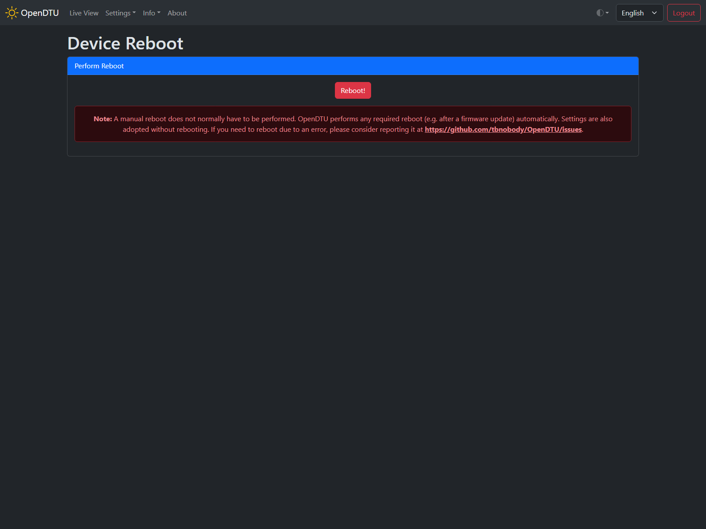
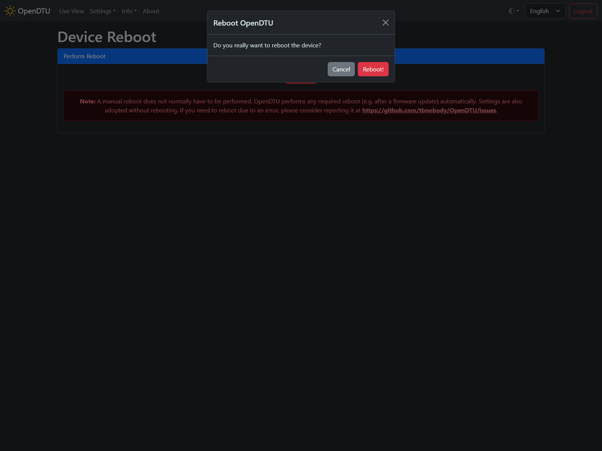

# Device Reboot

## Screenshot

## Settings / Parameters

### Perform Reboot

#### Reboot :material-button-cursor:{title="Button"}

Press this button to restart the ESP. A additional confirmation is required before the action is performed.
