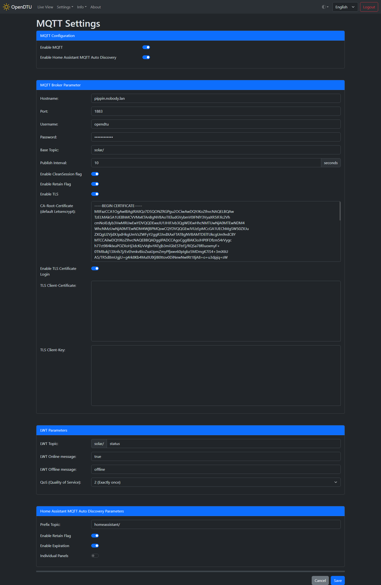

# MQTT Settings

!!! note ""
    **Tip:** Learn more about the protocol on [MQTT Essentials](http://www.hivemq.com/mqtt-essentials/){target=_blank}

## Screenshot

## Settings / Parameters

### MQTT Configuration

#### Enable MQTT :material-toggle-switch:{title="Switch"}

Enables or disables the MQTT functionality.

#### Enable Home Assistant MQTT Auto Discovery :material-toggle-switch:{title="Switch"}

Enables or disables the [Home Assistant MQTT Auto Discovery](https://www.home-assistant.io/integrations/mqtt/#mqtt-discovery){target=_blank} functionality.

### MQTT Broker Parameter

These settings are only visible if [MQTT](#enable-mqtt) is enabled.

#### Hostname :material-form-textbox:{title="Textbox"}

Host name or IP address of your MQTT broker. Make sure your DNS servers are set up properly if you specify a host name.

#### Port :material-form-textbox:{title="Textbox"}

Port of your MQTT broker. Default port for unencrypted connections is `1883` and for encrypted connections `8883`.

#### Username :material-form-textbox:{title="Textbox"}

Optional username to connect to your MQTT broker. Leave emtpy to perform an anonymous connection.

#### Password :material-form-textbox:{title="Textbox"}

Optional password to connect to your MQTT broker.

#### Base Topic :material-form-textbox:{title="Textbox"}

Below the base topic all the payload data is published via separate topics. An overview of all available topics can be found [here](../mqtt_topics.md).

#### Publish Interval :material-form-textbox:{title="Textbox"}

The interval at which the MQTT data is published.

#### Enable CleanSession flag :material-toggle-switch:{title="Switch"}

Enables the CleanSession[^3] flag for MQTT communication.

#### Enable Retain flag :material-toggle-switch:{title="Switch"}

Publish all information with retain[^2] flag. This has the advantage that each value is immediately available if you connect to your broker and subscribe to the specific topics you will get immediately the latest values.

#### Enable TLS :material-toggle-switch:{title="Switch"}

Enables a secure TLS connection to your MQTT broker. If using this you have to get a proper certificate (self signed will not work, it has to be signed by a CA) and the hostname entered as MQTT Hostname must match the CN in the certificate. You must also specify the CA-Root-Certificate.

#### CA-Root-Certificate :material-form-textbox:{title="Textbox"}

The root certificate of your CA if you are using a TLS connection to your broker. Should include the `-----BEGIN CERTIFICATE-----` and `-----END CERTIFICATE-----` tags.

#### Enable TLS Certificate Login :material-toggle-switch:{title="Switch"}

Uses certificates to authenticate against a MQTT broker. When enabled, the **TLS Client-Certificate** and the **TLS Client-Key** has to be supplied.

#### TLS Client-Certificate :material-form-textbox:{title="Textbox"}

Should include the `-----BEGIN CERTIFICATE-----` and `-----END CERTIFICATE-----` tags.

#### TLS Client-Key :material-form-textbox:{title="Textbox"}

Should include the `-----BEGIN CERTIFICATE-----` and `-----END CERTIFICATE-----` tags.

### LWT Parameters

These settings are only visible if [MQTT](#enable-mqtt) is enabled.

#### LWT Topic :material-form-textbox:{title="Textbox"}

Sets the topic of the LWT[^1] Message

#### LWT Online message :material-form-textbox:{title="Textbox"}

Sets the payload that will be published to the LWT Topic if the device comes online.

#### LWT Offline message :material-form-textbox:{title="Textbox"}

Sets the payload that will be set to the LWT Topic if the device becomes unavailable.

#### QoS (Quality of Service) :material-form-dropdown:{title="Dropdown"}

Sets the QoS of the LWT topic.

### Home Assistant MQTT Auto Discovery Parameters

These settings are only visible if [Enable Home Assistant MQTT Auto Discovery](#enable-home-assistant-mqtt-auto-discovery) is enabled.

Home Assistant provides the [MQTT integration](https://www.home-assistant.io/integrations/mqtt/){target=_blank} and through this integration it is possible to exploit and manage the messages published by OpenDTU.
Once this integration on home assistant is configured with the same MQTT broker, it is possible to create devices manually or through the autodiscovery function.

#### Prefix Topic :material-form-textbox:{title="Textbox"}

The base under which all Home Assistant MQTT Auto Discovery magic happens. If you haven't changed this topic in your Home Assistant installation the default `homeassistant/` is the right one.

#### Enable Retain Flag :material-toggle-switch:{title="Switch"}

Publish all auto discovery information with retain[^2] flag. This has the advantage that Home Assistant automatically finds all devices on restart.

#### Enable Expiration :material-toggle-switch:{title="Switch"}

When enabled, values in Home Assistant will become "unavailable" if they don't receive an update in a given time.

#### Individual Panels :material-toggle-switch:{title="Switch"}

When enabled, the data each individual panel will be made available in Home Assistant

[^1]: [Last Will and Testament](https://www.hivemq.com/blog/mqtt-essentials-part-9-last-will-and-testament/){target=_blank}
[^2]: [Retained Messages](https://www.hivemq.com/blog/mqtt-essentials-part-8-retained-messages/){target=_blank}
[^3]: [CleanSession](https://www.hivemq.com/blog/mqtt-essentials-part-7-persistent-session-queuing-messages/){target=_blank}