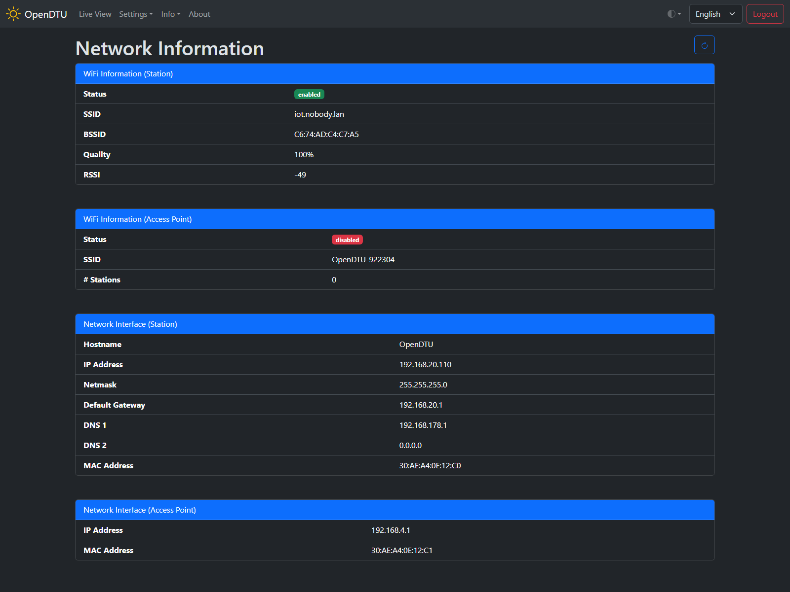

# Network Info

## Screenshot

## Settings / Parameters

### Wi-Fi Information (Station)

#### Status

#### SSID

#### BSSID

#### Quality

#### RSSI

### Wi-Fi Information (Access Point)

This section contain information about the internal access point which will be opened at device startup or if no connection to the configured Wi-Fi or ethernet can be established.

#### Status

Indicates whether the internal access point is active or not.

#### SSID

Name of the internal access point. Password for the internal access point equals the `admin` password of the Web UI.

#### # Stations

Number of station currently connected to the internal access point.

### Network Interface (Station)

#### Hostname

#### IP Address

#### Netmask

#### Default Gateway

#### DNS 1

#### DNS 2

#### MAC Address

### Network Interface (Access Point)

#### IP Address

IP address of OpenDTU when a client is connected via the internal access point.

#### MAC Address

MAC address of the internal access point
