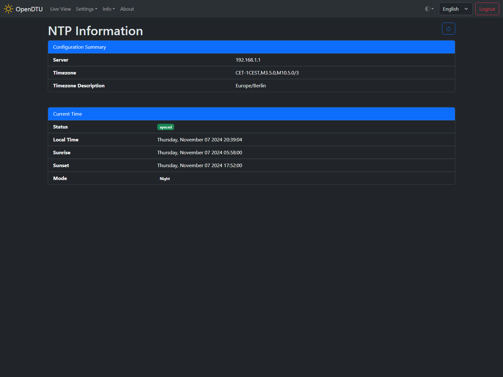

# NTP Information

## Screenshot

## Settings / Parameters

### Configuration Summary

#### Server

Hostname or IP address of the configured NTP server.

#### Timezone

Technical representation of the configured time zone.

#### Timezone Description

Timezone description in human readable form.

### Current time

#### Status

Shows whether the internal clock of the ESP is syned with the configured NTP server. This is required to send requests to the inverter.

#### Local Time

NTP servers provide the time in UTC[^1] time format. It is nescesary to convert the UTC time to your local time zone based on the configuration. This value should show your local time, otherwise the timezone configuration is not correct.

#### Sunrise

Time of todays sunrise. Used to set the day/night mode.

#### Sunset

Time of todays sunset. Used to set the day/night mode.

#### Mode

Shows the current operation mode (day/night). Depending on your inverter configuration data is fetched / commands are sent to the inverter.

[^1]: [Coordinated Universal Time](https://en.wikipedia.org/wiki/Coordinated_Universal_Time){target=_blank}
