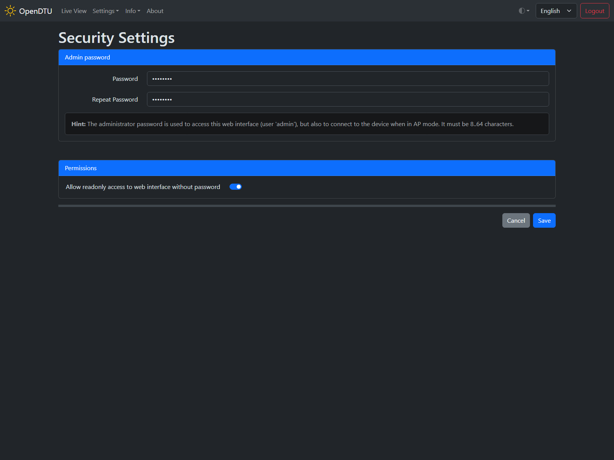

# Security Settings

## Screenshot

## Settings / Parameters

### Admin password

#### Password :material-form-textbox-password:{title="Textbox"}

This password is used both to log in to the web interface and to connect to the [Admin Access Point](network_settings.md#access-point-timeout).

#### Repeat Password :material-form-textbox-password:{title="Textbox"}

Enter the same password as above. Just to make sure there is no typo.

### Permissions

#### Allow readonly access to web interface without password :material-toggle-switch:{title="Switch"}

By default, any access to OpenDTU data is password restricted. If you enable this feature guest users are able to access read-only information (like [Live View](live_view.md) or [System Information](system_info.md)) without password.
