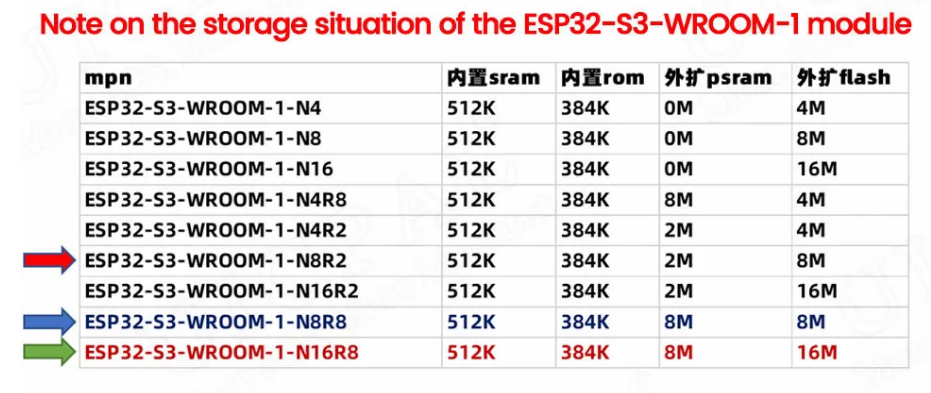
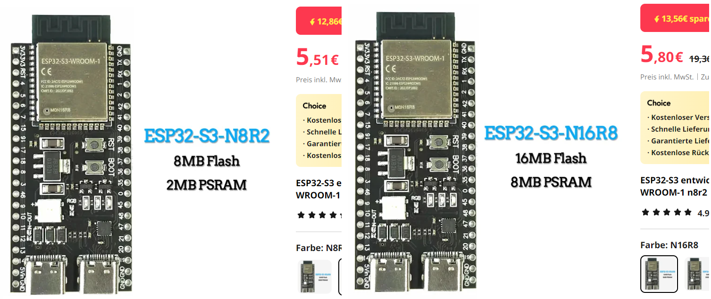

Due to the growing size of the code and the memory limitations of the common ESP32 boards (4Mb Flash) on the market today, we predict sometime in the future that, ESP32 boards with minimum 8Mb will be necessary to run the OpenDTU-onBattery code. 

Such boards' naming will have the ESP32-S3 and -N8R, -N16R, -N32R indicating 8MB,16Mb or 32Mb Flash memory respectively.

