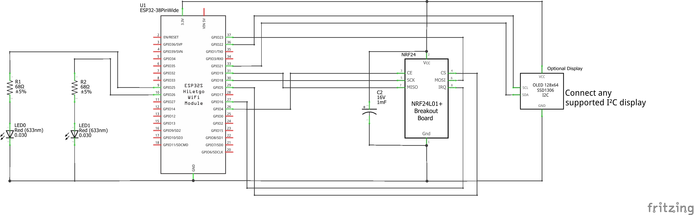

# ESP32 NodeMCU 38 pin

!!!warning "Input-Only Pins"
    Pins GPIO 34, 35, 36, and 39 are input-only pins and cannot be used as
    outputs. If you are not sure what that means, do not use these pins at all.

To use this board please refer to the [Device
Profile](../firmware/device_profiles.md) called `nodemcu_esp32.json` or
`blinkyparts_esp32.json`. Both are nicely compatible with the dev board. Open
the JSON file with a text editor and have a look at the specific pin numbers.

## Schematic

## Symbolic View

