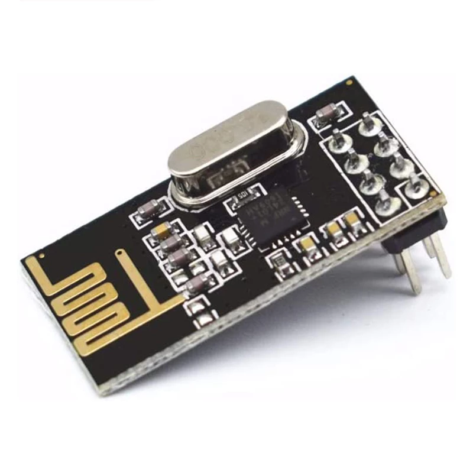
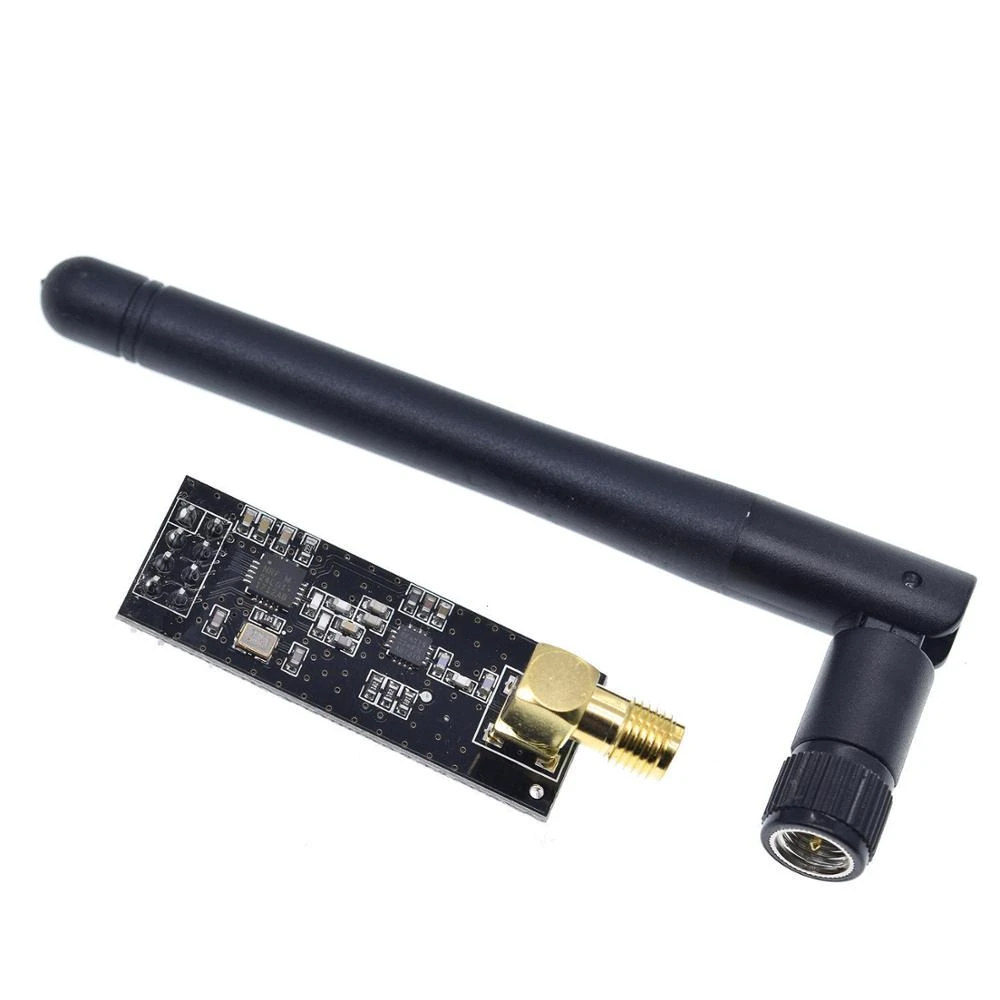

# NRF24L01 Module

## Technical details

| Property | Value |
| ---- | ---------- |
| Name | nRF24L01+ |
| Frequency | 2.4GHz |
| Datasheet | [Link](https://www.sparkfun.com/datasheets/Components/SMD/nRF24L01Pluss_Preliminary_Product_Specification_v1_0.pdf){target=_blank} |

## Description

The NRF24L01+ module is a 2,4GHz RF module. **It is absolutly important to get the newer PLUS variant!** (Only the PLUS variant supports the required transmission speeds and is able to communicate with the inverter)
There are several variants with different qualities and prices. Most of them are pin compatible. A noteable brand name is e.g. [EBYTE ML01DP5](https://www.ebyte.com/en/pdf-down.aspx?id=1136){target=_blank}. It includes a proper shielding and integrated capacitors.

Buy your hardware from a trusted source, at best from a dealer/online shop in your country where you have support and the right to return non-functional hardware.
When you want to buy from Amazon, AliExpress, eBay etc., take note that there is a lot of low-quality or fake hardware offered. Read customer comments and ratings carefully!

A heavily incomplete list of trusted hardware shops in germany is:

* [AZ-Delivery](https://www.az-delivery.de/)
* [Makershop](https://www.makershop.de/)
* [Berrybase](https://www.berrybase.de/)

This list is for your convenience only, the project is not related to any of these shops.

## Pictures

<figure markdown>
  { width="400" }
  <figcaption markdown>EBYTE ML01DP5 module</figcaption>
</figure>

<figure markdown>
  { width="400" }
  <figcaption markdown>Generic nRF24L01+ Module with PCB antenna</figcaption>
</figure>

<figure markdown>
  { width="400" }
  <figcaption markdown>Generic nRF24L01+ Module with SMA antenna</figcaption>
</figure>

## Pin assignment

The connection pins from the nRF24L01+ module to the ESP32 module can dynamically configured using [Device Profiles](../firmware/device_profiles.md) (prefered method) or at compile time.

| Name in Device Profile | Pin Function | Description | Possible name(s) on PCB |
| ---------------------- | ------------ | ----------- | -------------------- |
| miso | Digital Output | SPI Slave Data Output | MISO |
| mosi | Digital Input | SPI Slave Data Input | MOSI |
| clk | Digital Input | SPI Clock | CLK, SCK |
| irq | Digital Output | Interrupt pin | IRQ |
| en | Digital Input | Chip Enable | EN, CE |
| cs | Digital Input | SPI Chip Select | CS, CSN |
|    | Power | Power Supply (1,9V - 3.6V) | VDD, VCC |
|    | Power | Ground | VSS, GND |
