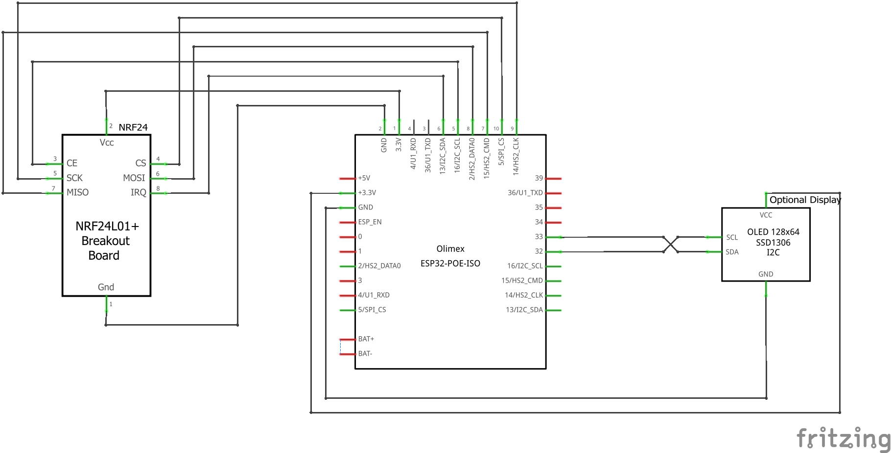
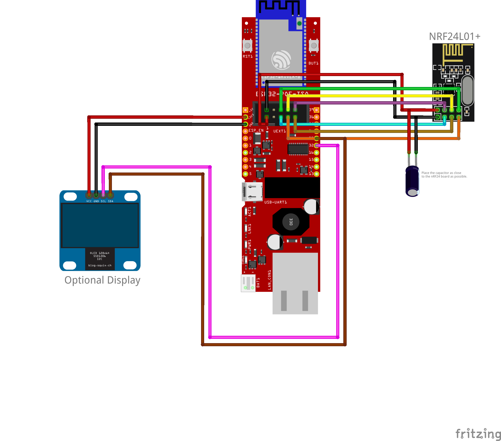

# Olimex ESP32-POE-ISO

## Technical details

| Property | Value |
| ---- | ---------- |
| Name | Olimex ESP32-POE-ISO |
| Product Info | [Link](https://www.olimex.com/Products/IoT/ESP32/ESP32-POE/open-source-hardware){target=_blank} |

## Description

To use this board please refere to the [Device Profile](../firmware/device_profiles.md) called `olimex_esp32_poe.json`. Depending on the features (LEDs) or display type you need you can easily adjust the existing config. Open the JSON file with a text editor and have a look at the specific pin numbers.

## Schematic

## Symbolic View

